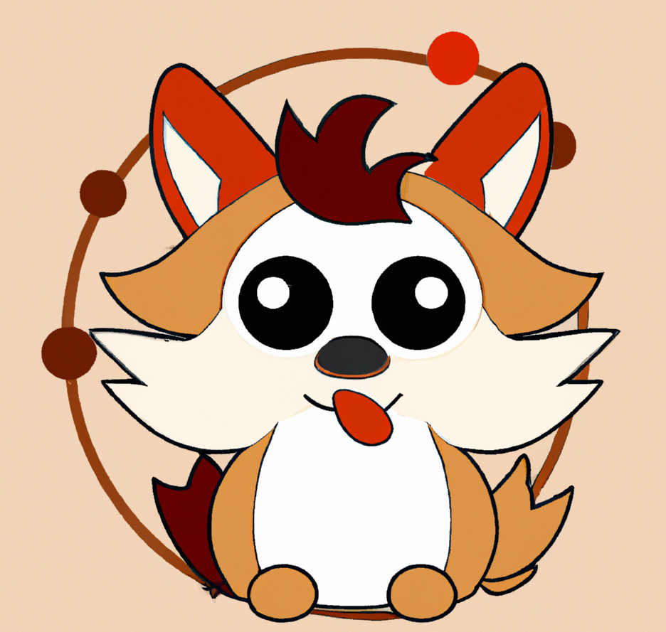

<div align="center">
  <h1>Chaosmania</h1>
  <p align="center">
    
  </p>
    <h2>Instant chaos for your microservices application!</h2>
    <h4> created by <a href="https://www.causely.io">Causely</h4>
  <p>

[](https://opensource.org/licenses/Apache-2.0)
<br>

</div>

# Chaosmania Documentation

## Introduction
ChaosMania is a tool designed to simulate various application problems in a microservices architecture running on Kubernetes. It provides a set of actions that can be triggered to simulate different scenarios, allowing users to experiment with the resilience and stability of their microservices-based applications.

## Actions
ChaosMania provides several actions that can be executed to simulate different application problems. These actions are located in the pkg/actions/ directory. Here is a list of available actions:

* allocate_memory.go: Simulates memory allocation issues.
* burn.go: Simulates high CPU usage or resource exhaustion.
* global_mutex_unlock.go: Simulates a global mutex unlock issue.
* http_response.go: Simulates HTTP response issues.
* print.go: Simulates printing or logging events.
* sleep.go: Simulates delay or slow response times.
* background_task.go: Simulates long-running background tasks.
* global_mutex_lock.go: Simulates a global mutex lock issue.
* http_request.go: Simulates HTTP request issues.
* mysql.go: Simulates problems related to MySQL databases.
* postgresql.go: Simulates problems related to PostgreSQL databases.
* redis.go: Simulates problems related to Redis databases.
* utils.go: Provides utility functions used by other actions.

## Plans
ChaosMania uses plans to define and trigger specific scenarios. These plans are created by the client and are located in the plans/examples/ directory. Each plan is defined in a YAML file and specifies the actions to be executed and their configuration parameters.

Here is a list of example plans available in the plans/examples/ directory:

* acquire_lock.yaml: Simulates lock acquisition issues.
* background_task.yaml: Simulates long-running background task scenarios.
* http_request.yaml: Simulates HTTP request-related scenarios.
* mysql.yaml: Simulates scenarios specific to MySQL databases.
* print.yaml: Simulates printing or logging events.
* allocate_memory.yaml: Simulates scenarios related to memory allocation.
* burn.yaml: Simulates high CPU usage or resource exhaustion.
* http_response.yaml: Simulates scenarios related to HTTP responses.
* postgresql.yaml: Simulates scenarios specific to PostgreSQL databases.
* redis.yaml: Simulates scenarios specific to Redis databases.
* sleep.yaml: Simulates scenarios related to delays or slow response times.

## Local Development

### Server

```shell
go run ./cmd/chaosmania server --port 8080
```

### Client

```shell
go run ./cmd/chaosmania client -p ./plans/examples/burn.yaml --host localhost --port 8080
```

## Build Container Images

```shell
make image
```

## Deploy server to Kubernetes

Single server and/or the boutique microservices:

```shell
helm upgrade --install --create-namespace --namespace chaosmania single ./helm/single
helm upgrade --install --create-namespace --namespace chaosmania boutique ./helm/boutique
```

## Start a job

Using kubectl

```shell
kubectl create job chaos-plan --image=quay.io/causely/chaosmania -- /bin/chaosmania client -p /plans/boutique.yaml --host <host> --port 8080
```

Using helm

```shell
helm upgrade --install --create-namespace --namespace chaosmania client ./helm/client
```

Optionally provide a custom plan from the plans directory
```shell
helm upgrade --install --create-namespace --namespace chaosmania client ./helm/client  --set chaos.plan="/plans/frequentdb.yaml"
```
