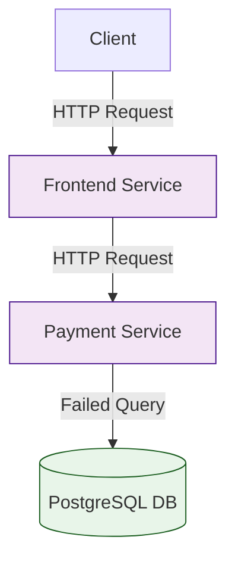

# Chained Services with Database Unavailability Scenario

## Overview

This scenario demonstrates the behavior of a microservices architecture when the database becomes unavailable. The scenario sets up a chain of services where:

1. Frontend Service: Makes requests to the Payment service
2. Payment Service: Attempts to interact with a PostgreSQL database that is unavailable
3. Database: PostgreSQL instance that is intentionally made unavailable by not deploying it to the cluster

The workload includes:
- 1 worker instance
- 1-hour duration
- 5s delay between requests
- 5000 iterations of the workload
- Memory allocation and CPU burn operations
- HTTP requests between services
- Database operations that will fail due to the missing database deployment

The goal of this scenario is to demonstrate how database unavailability affects service chains and how errors propagate through the system when a critical dependency is missing.

## Topology

- **Frontend Service**: Entry point service that initiates requests
- **Payment Service**: Middleware service that attempts database operations
- **PostgreSQL Database**: Database service that is intentionally unavailable (not deployed to the cluster)
- **Istio**: Service mesh for traffic management and monitoring

## Folder Structure

```plaintext
scenarios/
├── chained-services-db-unavailable/
│   ├── plan.yaml
│   ├── run.sh
│   ├── README.md
```

## Configuration Files

- **plan.yaml**

This file defines the ChaosMania plan for the scenario. The plan includes:
- Memory allocation operations (1000 bytes, 1000 allocations)
- CPU burn operations (20ms for frontend, 10ms for payment)
- HTTP requests from frontend to payment service
- PostgreSQL database operations that will fail
- Client worker configuration with 1 instance

- **run.sh**

This script sets up the environment by:
- Creating and configuring the namespace
- Enabling Istio injection
- Deploying the frontend service (2 replicas)
- Deploying the payment service (2 replicas)
- Deploying the client with the chaos plan

## Data Flow Schema


