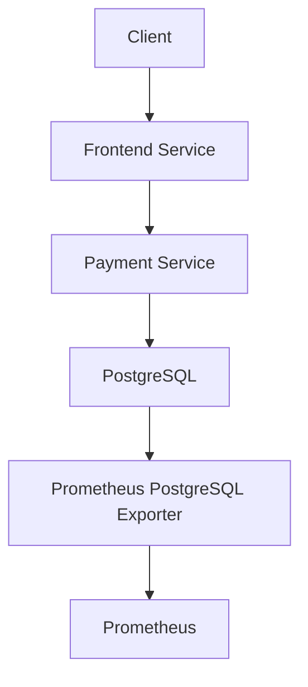

# Chained Services with Database Interaction Scenario

## Overview

This scenario is designed to simulate and analyze the impact of complex service interactions with database operations in a microservices architecture. The scenario demonstrates how database operations can affect service performance and how these effects cascade through dependent services. The plan combines multiple operations in a single phase:

The scenario performs concurrent operations including:
- Memory allocation and CPU-intensive operations
- Database table creation and management
- Data insertion with random values
- Random data updates and deletions
- Complex database queries
- HTTP requests between services

These operations are repeated 5000 times with 2 worker instances running for 1 hour, creating a sustained load that simulates real-world scenarios where database operations and service interactions can become bottlenecks in the system.

The goal of this scenario is to observe how database operations and service interactions affect the overall system performance, leading to potential delays in service responses and degraded user experience.

## Topology

- **Frontend Service**: Provides the user-facing interface and initiates service requests
- **Payment Service**: Handles payment transactions and database operations
- **PostgreSQL Database**: Stores and manages application data
- **PostgreSQL Exporter**: Monitors database performance metrics

## Folder Structure

```plaintext
scenarios/
├── chained-services/
│   ├── plan.yaml
│   ├── run.sh
│   ├── README.md
```

## Configuration Files

- **plan.yaml**

This file defines the ChaosMania plan for simulating database operations and service interactions. The plan includes actions for memory allocation, CPU usage, and various database operations including:
- Table creation
- Data insertion
- Random data updates
- Data deletion
- Complex queries

- **run.sh**

This script sets up the environment, deploys the necessary services including PostgreSQL and its exporter, and runs the ChaosMania scenario defined in the plan.yaml file.

## Data Flow Schema



## Monitoring

The scenario includes monitoring capabilities through:
- PostgreSQL Exporter for database metrics
- Prometheus for metrics collection
- Service-level monitoring through Istio
