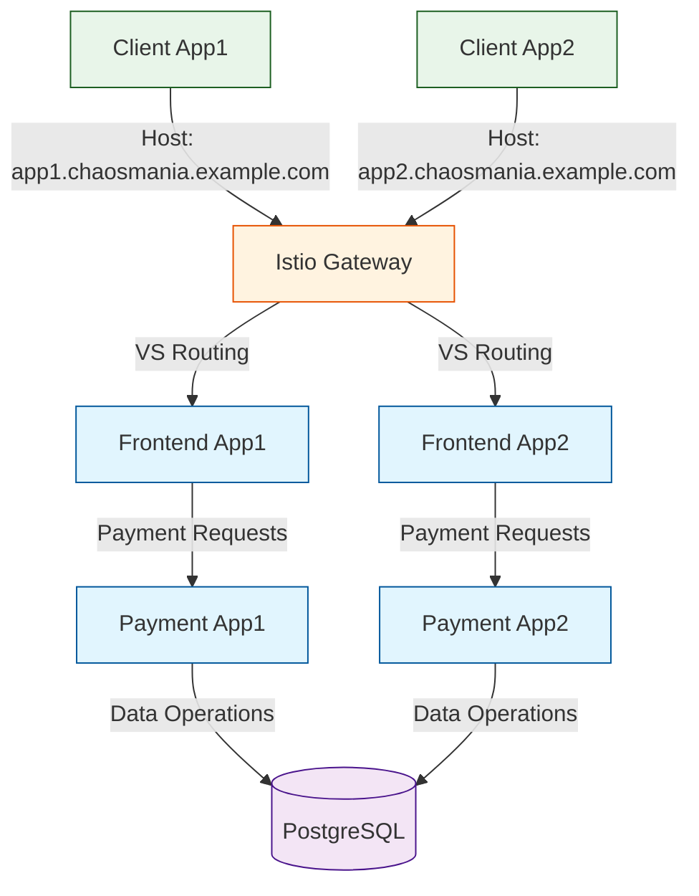

# Chained Virtual Services Scenario

## Overview

This scenario demonstrates a microservices architecture using Istio virtual services and gateway patterns. The scenario sets up two parallel applications (app1 and app2), each with its own:

1. Frontend Service: A web application that handles user interface and interactions
2. Payment Service: A service that processes payments and connects to a shared database

Both applications are configured with:
- Virtual services for traffic routing
- Gateway configuration for external access
- Shared PostgreSQL database for payment processing
- Istio service mesh for traffic management and monitoring
- Client workloads that simulate traffic patterns

The goal of this scenario is to provide a baseline for demonstrating service mesh capabilities and traffic routing patterns without introducing any error states or root causes.

## Topology

- **Frontend Services**: Two web applications (frontend-app1, frontend-app2) with virtual service configurations
- **Payment Services**: Two payment processing services (payment-app1, payment-app2) with virtual service configurations
- **Gateway**: Istio ingress gateway for external traffic management
- **PostgreSQL**: Shared database for payment data
- **Client Workloads**: Two client deployments (client-app1, client-app2) that generate traffic
- **Istio**: Service mesh for traffic management and monitoring

## Folder Structure

```plaintext
scenarios/
├── chained-virtual-services/
│   ├── app1-plan.yaml
│   ├── app1-vs.yaml
│   ├── app2-plan.yaml
│   ├── app2-vs.yaml
│   ├── gateway.yaml
│   ├── run.sh
│   ├── README.md
```

## Configuration Files

- **app1-plan.yaml** and **app2-plan.yaml**

These files define the ChaosMania plans for both applications. Each plan includes:
- Client worker configuration (1 instance, 1-hour duration, 5s delay)
- Memory allocation and CPU burn operations
- HTTP requests to respective payment services
- PostgreSQL queries to the shared database

- **app1-vs.yaml** and **app2-vs.yaml**

These files define the Istio virtual service configurations for each application:
- Host-based routing (app1.chaosmania.example.com, app2.chaosmania.example.com)
- Gateway integration
- Service routing rules

- **gateway.yaml**

This file defines the Istio gateway configuration:
- Gateway resource definition
- HTTP server configuration
- Host selector configuration

- **run.sh**

This script sets up the environment by:
- Creating and configuring the namespace
- Enabling Istio injection
- Deploying the Istio ingress gateway
- Deploying the shared PostgreSQL database
- Deploying frontend and payment services for both applications
- Configuring virtual services
- Deploying client workloads for both applications

## Data Flow Schema


