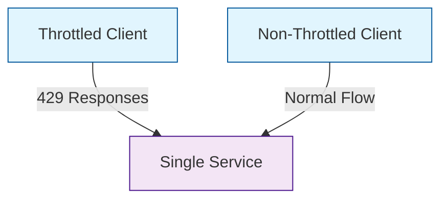

# Client Throttling Comparison Scenario

## Overview

This scenario is designed to demonstrate and compare the behavior of client applications under different throttling conditions. The scenario sets up two parallel client deployments:

1. Throttled Client: Simulates a client that receives 429 (Too Many Requests) responses
2. Non-Throttled Client: Simulates a client operating under normal conditions

Both clients run identical workloads with:
- 3 worker instances
- 1-hour duration
- 500ms delay between requests
- 5000 iterations of the workload
- Minimal CPU burn (1ms) per request

The goal of this scenario is to provide a baseline for comparing client behavior and performance metrics between throttled and non-throttled conditions, without introducing any error states or root causes.

## Topology

- **Single Service**: The target service with CPU limits set to 500m
- **Throttled Client**: Client deployment configured to receive 429 responses
- **Non-Throttled Client**: Client deployment operating under normal conditions
- **Istio**: Service mesh for traffic management and monitoring

## Folder Structure

```plaintext
scenarios/
├── client-throttled/
│   ├── throttled.yaml
│   ├── not_throttled.yaml
│   ├── run.sh
│   ├── README.md
```

## Configuration Files

- **throttled.yaml**

This file defines the ChaosMania plan for the throttled client scenario. The plan includes:
- HTTP response configuration to return 429 status codes
- Minimal CPU burn operations
- Client worker configuration with 3 instances

- **not_throttled.yaml**

This file defines the ChaosMania plan for the non-throttled client scenario. The plan includes:
- Same client worker configuration as throttled scenario
- Minimal CPU burn operations
- No throttling responses

- **run.sh**

This script sets up the environment by:
- Creating and configuring the namespace
- Enabling Istio injection
- Deploying the single service with CPU limits
- Deploying both throttled and non-throttled client configurations

## Data Flow Schema


