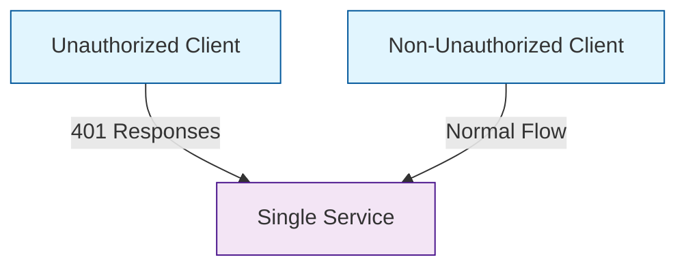

# Client Unauthorized Comparison Scenario

## Overview

This scenario is designed to demonstrate and compare the behavior of client applications under different authorization conditions. The scenario sets up two parallel client deployments:

1. Unauthorized Client: Simulates a client that receives 401 (Unauthorized) responses
2. Non-Unauthorized Client: Simulates a client operating under normal conditions

Both clients run identical workloads with:
- 3 worker instances
- 1-hour duration
- 500ms delay between requests
- 5000 iterations of the workload
- Minimal CPU burn (1ms) per request

The goal of this scenario is to provide a baseline for comparing client behavior and performance metrics between unauthorized and authorized conditions, without introducing any error states or root causes.

## Topology

- **Single Service**: The target service with CPU limits set to 500m
- **Unauthorized Client**: Client deployment configured to receive 401 responses
- **Non-Unauthorized Client**: Client deployment operating under normal conditions
- **Istio**: Service mesh for traffic management and monitoring

## Folder Structure

```plaintext
scenarios/
├── client-unauthorized/
│   ├── unauthorized.yaml
│   ├── not_unauthorized.yaml
│   ├── run.sh
│   ├── README.md
```

## Configuration Files

- **unauthorized.yaml**

This file defines the ChaosMania plan for the unauthorized client scenario. The plan includes:
- HTTP response configuration to return 401 status codes
- Minimal CPU burn operations
- Client worker configuration with 3 instances

- **not_unauthorized.yaml**

This file defines the ChaosMania plan for the non-unauthorized client scenario. The plan includes:
- Same client worker configuration as unauthorized scenario
- Minimal CPU burn operations
- No unauthorized responses

- **run.sh**

This script sets up the environment by:
- Creating and configuring the namespace
- Enabling Istio injection
- Deploying the single service with CPU limits
- Deploying both unauthorized and non-unauthorized client configurations

## Data Flow Schema


