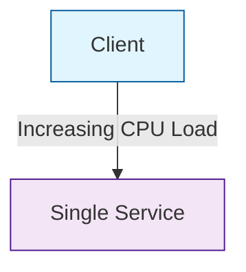

# Container CPU Congestion Scenario

## Overview

This scenario is designed to demonstrate the behavior of a service under increasing CPU load conditions. The scenario sets up a client deployment that gradually increases CPU usage on the target service:

1. Phase 1: Simulates moderate CPU load with 500ms burn duration
2. Phase 2: Simulates higher CPU load with 1000ms burn duration

The client runs with:
- 10 worker instances
- 1-hour duration
- 500ms delay between requests
- Increasing CPU burn duration (500ms to 1000ms)

The goal of this scenario is to observe how the service behaves under increasing CPU load conditions, particularly focusing on performance degradation and potential throttling effects.

## Topology

- **Single Service**: The target service with CPU limits set to 500m
- **Client**: Client deployment configured to generate increasing CPU load
- **Istio**: Service mesh for traffic management and monitoring

## Folder Structure

```plaintext
scenarios/
├── container-cpu-congestion/
│   ├── plan.yaml
│   ├── run.sh
│   ├── README.md
```

## Configuration Files

- **plan.yaml**

This file defines the ChaosMania plan for the CPU congestion scenario. The plan includes two phases:
- Phase 1: Moderate CPU load with 500ms burn duration
- Phase 2: Higher CPU load with 1000ms burn duration
- Client worker configuration with 10 instances per phase

- **run.sh**

This script sets up the environment by:
- Creating and configuring the namespace
- Enabling Istio injection
- Deploying the single service with CPU limits (500m)
- Deploying the client with the CPU congestion plan

## Data Flow Schema


