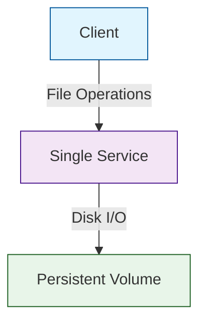

# Container Data Disk Throughput Throttling Scenario

## Overview

This scenario is designed to demonstrate and analyze the behavior of applications under disk throughput throttling conditions. The scenario sets up a client deployment that performs intensive disk I/O operations:

- 3 worker instances
- 1-hour duration
- No delay between operations
- 5000 iterations of the workload
- Each iteration creates and deletes a 100MB file

The goal of this scenario is to observe and analyze how the application behaves when disk throughput is throttled, particularly focusing on the performance impact of file creation and deletion operations.

## Topology

- **Single Service**: The target service with a 100Gi persistent volume
- **Client**: Client deployment configured to perform disk I/O operations
- **Istio**: Service mesh for traffic management and monitoring
- **Persistent Volume**: 100Gi storage for disk operations

## Folder Structure

```plaintext
scenarios/
├── container-data-disk-tp-throttled/
│   ├── plan.yaml
│   ├── run.sh
│   ├── README.md
```

## Configuration Files

- **plan.yaml**

This file defines the ChaosMania plan for the disk throughput throttling scenario. The plan includes:
- File creation and deletion operations
- 100MB file size per operation
- Client worker configuration with 3 instances
- 5000 iterations of the workload
- 1-hour duration

- **run.sh**

This script sets up the environment by:
- Creating and configuring the namespace
- Enabling Istio injection
- Deploying the single service with a 100Gi persistent volume
- Deploying the client configuration with disk I/O operations

## Data Flow Schema


