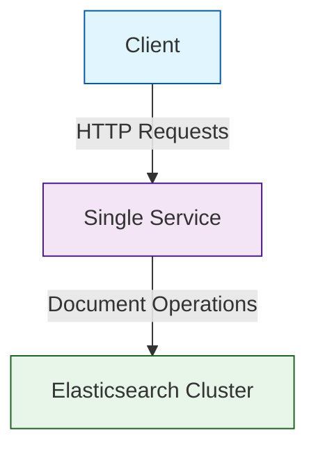

# Elasticsearch Integration Scenario

## Overview

This scenario is designed to demonstrate the behavior of a client application interacting with an Elasticsearch cluster. The scenario sets up:

1. A client deployment that performs both document insertions and queries against Elasticsearch
2. A single service deployment that serves as the application layer

The client runs a workload with:
- 1 worker instance
- 1-hour duration
- 10s delay between requests
- 5000 iterations of the workload
- Elasticsearch document insertions and queries

Note: This scenario requires an external Elasticsearch cluster to be available and properly configured. The cluster details (address and API key) need to be configured in the plan.yaml file.

## Topology

- **Single Service**: The target service with Istio injection enabled
- **Client**: Client deployment configured to perform Elasticsearch operations
- **Elasticsearch**: External Elasticsearch cluster (must be configured separately)
- **Istio**: Service mesh for traffic management and monitoring

## Folder Structure

```plaintext
scenarios/
├── elasticsearch/
│   ├── plan.yaml
│   ├── run.sh
│   ├── README.md
```

## Configuration Files

- **plan.yaml**

This file defines the ChaosMania plan for the Elasticsearch scenario. The plan includes:
- ElasticInsert action for document insertion
- ElasticQuery action for document retrieval
- Client worker configuration with 1 instance
- Configuration for Elasticsearch connection (address, index, API key)

- **run.sh**

This script sets up the environment by:
- Creating and configuring the namespace
- Enabling Istio injection
- Deploying the single service
- Deploying the client with the Elasticsearch workload plan

## Data Flow Schema



## Prerequisites

Before running this scenario, ensure that:
1. An Elasticsearch cluster is available and accessible
2. The Elasticsearch cluster address and API key are configured in plan.yaml
3. The target index exists in the Elasticsearch cluster
4. The necessary permissions are granted for document operations
